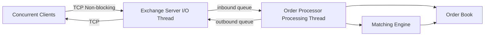
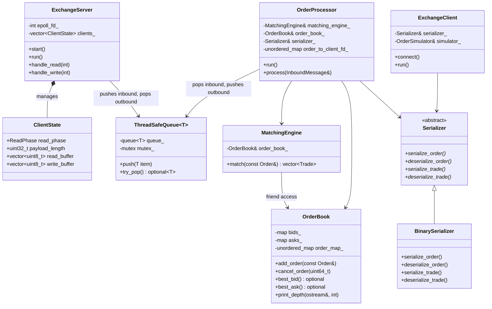

# Exchange Simulator

High-performance simulated exchange built from scratch in C++. Order book, matching engine, binary serialization, TCP networking, multithreaded I/O and processing pipeline.

## Architecture



## Components



## Wire Format

```
┌──────────────┬──────────────────┬─────────────┐
│ Type (1 byte)│ Length (4 bytes) │ Payload (N) │
└──────────────┴──────────────────┴─────────────┘
```

## Optimizations

1. [TCP_NODELAY + Single Send Buffer](docs/improvements/nagles_algorithm.md) - 12 -> 46K ops/sec (3,800x)
2. [Pre-allocated Buffers](docs/improvements/pre_allocated_buffers.md) - 46K -> 50K ops/sec, 83% instruction reduction
3. [Epoll Multiplexing](docs/improvements/epoll_concurrency.md) - Unlocked multi-client support, 134K combined ops/sec
4. [Flat Arrays & Write Batching](docs/improvements/flat_arrays_write_batching.md) - 134K -> 152K ops/sec, eliminated epoll_ctl and hash map overhead
5. [Multithreaded I/O + Processing](docs/improvements/multithreading_mutex_queue.md) - Separated I/O from matching, 18% single-client gain, mutex contention under load

## Building

```bash
mkdir build && cd build
cmake ..
cmake --build .

# Terminal 1
./exchange

# Terminal 2
./client N  # number of concurrent clients (optional, default=1)
```

## Future Work

- Lock-free ring buffer queue
- Multicast UDP market data
- Shared memory ring buffers
- JSON serializer
- Unit testing