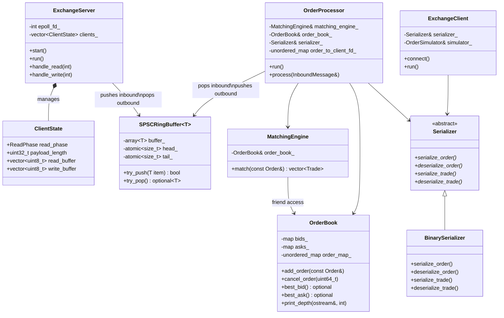

# Exchange Simulator

High-performance simulated exchange built from scratch in C++. Accepts orders over TCP sockets, matches with price-time priority, and routes fills to clients. Epoll I/O, multithreaded processing pipeline, lock-free queues, binary protocol. Profiled and optimized from 12 to 1.1M+ ops/sec.

## Architecture


## Components



## Wire Format

```
┌──────────────┬──────────────────┬─────────────┐
│ Type (1 byte)│ Length (4 bytes) │ Payload (N) │
└──────────────┴──────────────────┴─────────────┘
```

## Optimizations

1. [TCP_NODELAY + Single Send Buffer](docs/improvements/01-tcp-nodelay.md) - 12 -> 46K ops/sec (3,800x)
2. [Pre-allocated Buffers](docs/improvements/02-preallocated-buffers.md) - 46K -> 50K ops/sec, 83% instruction reduction
3. [Epoll Multiplexing](docs/improvements/03-epoll-concurrency.md) - Unlocked multi-client support, 134K combined ops/sec
4. [Flat Arrays & Write Batching](docs/improvements/04-flat-arrays-write-batching.md) - 134K -> 152K ops/sec, eliminated epoll_ctl and hash map overhead
5. [Multithreaded I/O + Processing](docs/improvements/05-multithreaded-architecture.md) - Separated I/O from matching, 18% single-client gain
6. [Lock-free SPSC Ring Buffer](docs/improvements/06-lock-free-ring-buffer.md) - Eliminated mutex contention, explored queue bottlenecks
7. [Client Pipelining & Read Batching](docs/improvements/07-client-pipelining-read-batching.md) - 153K single-client, 750K with 5 clients

## Building

```bash
mkdir build && cd build
cmake ..
cmake --build .

# Terminal 1
./exchange

# Terminal 2
./client N  # number of concurrent clients (optional, default=1)
```

## Future Work

- Multicast UDP market data
- Shared memory ring buffers
- JSON serializer
- Unit testing