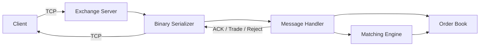
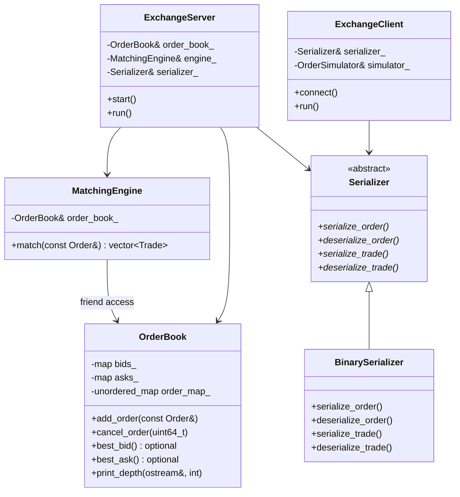

# Exchange Simulator

Simulated exchange built from scratch in C++. Order book, matching engine, binary serialization, TCP networking.

## Architecture



## Components



<!-- **Order Book** — 

**Matching Engine** — 

**Serialization** — 

**Networking** —  -->

## Wire Format

```
┌──────────────┬──────────────────┬─────────────┐
│ Type (1 byte)│ Length (4 bytes) │ Payload (N) │
└──────────────┴──────────────────┴─────────────┘
```

## Performance
## Optimizations

1. [TCP_NODELAY + Single Send Buffer](docs/improvements/nagles_algorithm.md) — 12 → 46K orders/sec (~3800x)
2. [Pre-allocated Buffers](docs/improvements/preallocated-buffers.md) — in progress

<!-- ## Design Decisions -->

<!-- Key tradeoffs: data structures, O(1) cancel, friend class, abstract serializer, TCP_NODELAY -->

## Building

```bash
mkdir build && cd build
cmake ..
cmake --build .

# Terminal 1
./exchange

# Terminal 2
./client
```

## Future Work

- Multithreading
- Multicast UDP market data
- Shared memory ring buffers
- JSON serializer
- Pre-allocated buffers
- Unit testing
- Unit testing