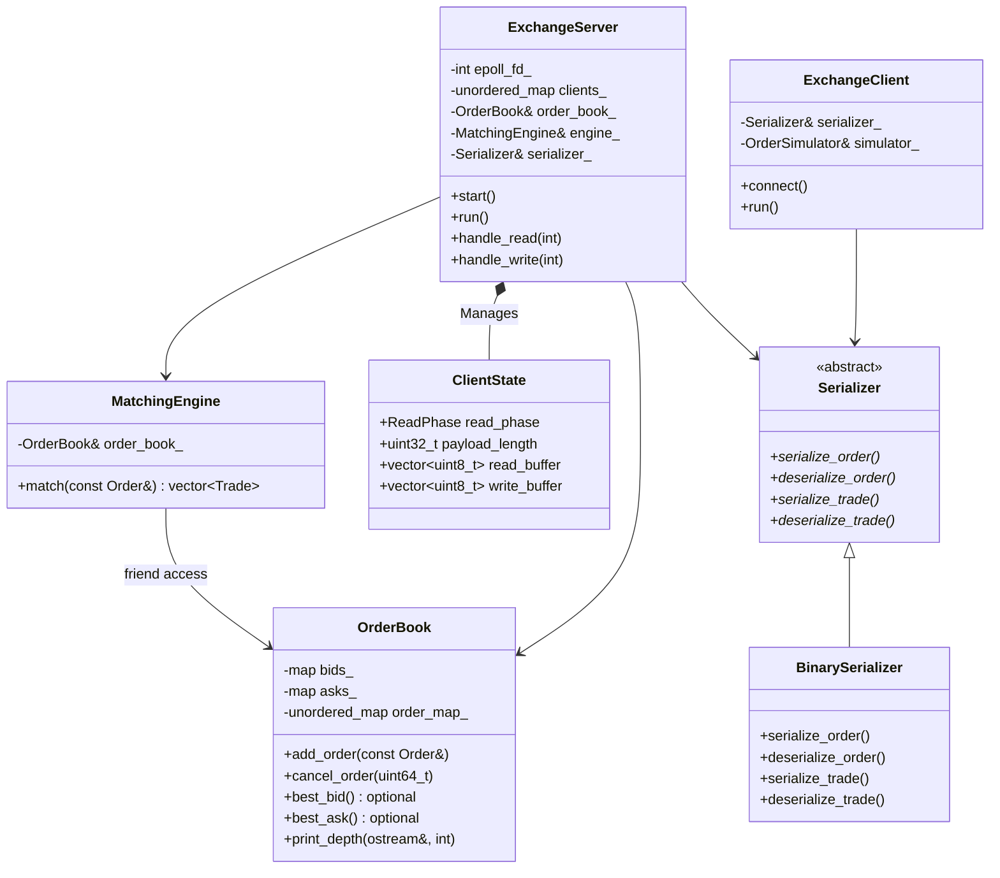

# Exchange Simulator

High-performance simulated exchange built from scratch in C++. Order book, matching engine, binary serialization, TCP networking.

## Architecture


## Components



<!-- **Order Book** — 

**Matching Engine** — 

**Serialization** — 

**Networking** —  -->

## Wire Format

```
┌──────────────┬──────────────────┬─────────────┐
│ Type (1 byte)│ Length (4 bytes) │ Payload (N) │
└──────────────┴──────────────────┴─────────────┘
```

<!-- ## Performance -->
## Optimizations
1. [TCP_NODELAY + Single Send Buffer](docs/improvements/nagles_algorithm.md) - 12 ops/sec -> 46K ops/sec (3,800x increase)
2. [Pre-allocated Buffers & Zero-Allocation Path](docs/improvements/pre_allocated_buffers.md) - 46K -> 50K ops/sec, 83% instruction reduction
3. [Non-blocking I/O & Epoll Multiplexing](docs/improvements/epoll_concurrency.md) - Unlocked horizontal scaling, 134K+ combined ops/sec

<!-- ## Design Decisions -->

<!-- Key tradeoffs: data structures, O(1) cancel, friend class, abstract serializer, TCP_NODELAY -->

## Building

```bash
mkdir build && cd build
cmake ..
cmake --build .

# Terminal 1
./exchange

# Terminal 2
./client N #number of concurrent clients(optional, default=1)
```

## Future Work

- Multithreading
- Multicast UDP market data
- Shared memory ring buffers
- JSON serializer
- Unit testing
